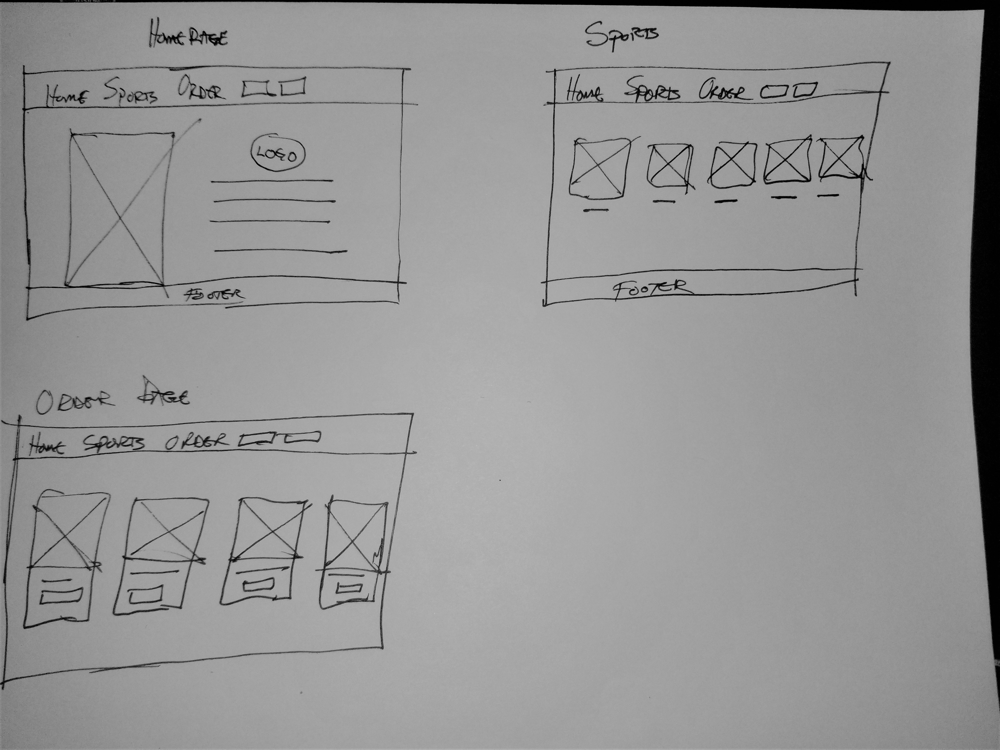
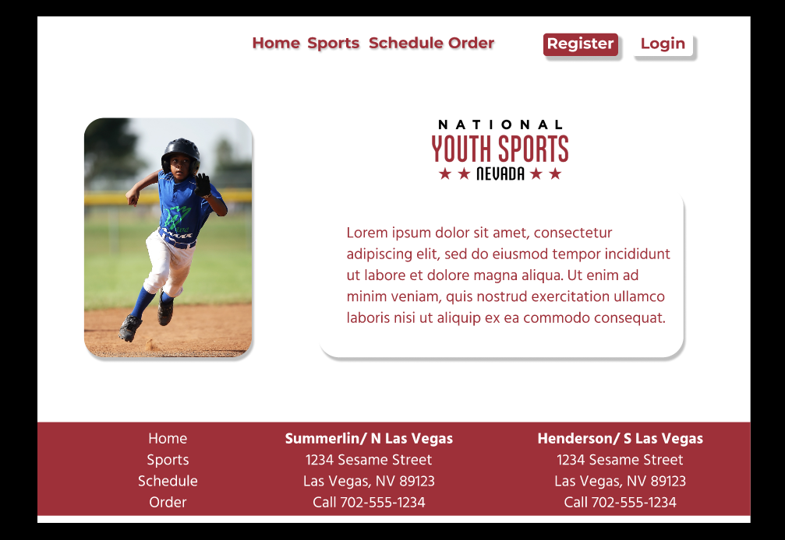
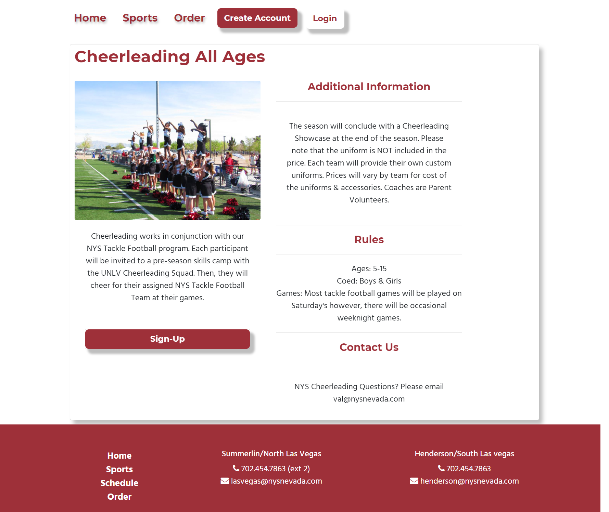

# National Youth Sports Nevada Re-Design 
#####([Link to project site](https://mrcmyk12.github.io/NYSNevadaRedesign/))

This is a re-design of an existing site **[National Youth Sports Nevada](https://nysnevada.com/)**.  This project was built using:

 **React, ReactStrap, Bootstrap, React-Router and CSS** 
 
 ---

## Motivation for Re-Design

This site was in desperate need of a re-design.  The existing site had **broken links**, **inconsistent layout**, and **poor usabilty** resulting in a below average user experience.

---

## Design Process

Original layout was designed first and paper, and then the mock-ups were created using **Figma**:

---

##Features

 * Forms to fill out for login and creating accounts
 * Forms to sign up for the various leagues
 * Cards explaining various league rules
 

